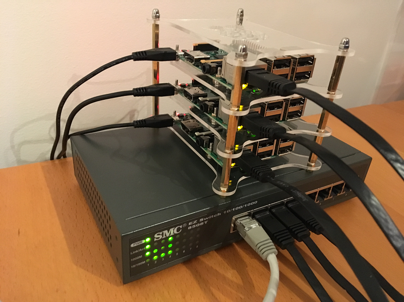
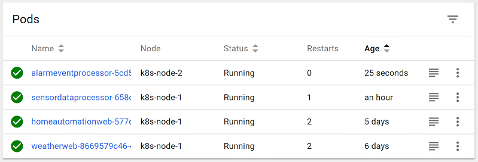

# Kubernetes Cluster Setup & Run ASP.NET Core 2.0 applications on Raspberry PI 3 
### Author: [Olav Tollefsen](https://www.linkedin.com/in/olavtollefsen/)

## Introduction

This article documents the process of installing a Kubernetes Cluster on Raspberry PI 3 from scratch. It also describes how to run an ASP.NET 2.0 Web Application in a Docker container on the cluster.

### What you will need

- A minimum of 2 x Raspberry PI 3 Model B with Micro SD card, power supply
- Network cables (I have not gotten this process to work with WiFi only)
- A switch to create a local network
- A computer with the ability to connect a Micro SD card and software to burn an image to the card

*Kubernetes Cluster with 3x Raspberry PI 3 (1 Master + 2 Nodes)*

 

## Perform these steps for all the Raspberry PI nodes that will form the Kubernetes cluster

### Prepare the Raspberry PI 3 Operating System on a Micro SD card

On a computer download the Linux operating system for Raspberry PI 3. I'm using Raspbian Stretch Lite, which you can dowload from [The Raspberry Pi Foundation Raspbian Download Page](https://www.raspberrypi.org/downloads/raspbian/).

Burn the downloaded operating system image to the Micro SD card. You will find more details in this [Installation Guide](https://www.raspberrypi.org/documentation/installation/installing-images/README.md)

### Add a new user and remove the default user

It's s good idea to create a new user for you on the Raspberry PI and remove the default user.

Add a new user:
```
$ sudo adduser <new-username>
```

Add the new user to sudoers:
```
$ sudo usermod -aG sudo <new-username>
```

To remove the default user you may need to reboot the Raspberry PI, login using the new-username and then perform this command:

```
$ sudo userdel -r pi
```

### Configure Networking

I like to set static IP addresses for the Raspberry PI cluster nodes. Edit the /etc/dhcpcd.conf file:

```
$ sudo nano /etc/dhcpcd.conf
```

Add the following to the bottom of the file:

```
interface=eth0
static ip_address=192.168.1.11/24
static routers=192.168.1.1
static domain_name_servers=8.8.8.8
```
The addresses above are just examples. Replace with the approperiate addresses for your environment.

### Change hostname / enable SSH / change local timezone

Invoke the raspi-config utility to change the hostname, enable SSH and change the local timezone:
```
sudo raspi-config
```
You will find the SSH option under "5 Interfacing Options".

You may also want to change the local timezone. The "Change Timezone" option is under "4 Localisation Options".

### Disable Swap

According to this article: [Cannot deploy Kubernetes 1.8.0 with Kubeadm 1.8.0 on Raspberry Pi #479]()https://github.com/kubernetes/kubeadm/issues/479 you will an error installing Kubernetes without disabling swap.

To disable swap:
```
$ sudo dphys-swapfile swapoff && \
  sudo dphys-swapfile uninstall && \
  sudo update-rc.d dphys-swapfile remove
```

Add the following to the end of the existing line of `/boot/cmdline.txt`:
```
cgroup_enable=cpuset cgroup_enable=memory cgroup_memory=1
```

### Reboot the Raspberry PI
```
$ sudo reboot
```

### Install Docker

```
$ curl -fsSL get.docker.com -o get-docker.sh
$ sudo sh get-docker.sh
```

To be able to issue Docker commands without sudo:
```
$ sudo usermod -aG docker <your-username>
```

### Install required Kubernetes software
```
$ curl -s https://packages.cloud.google.com/apt/doc/apt-key.gpg | sudo apt-key add - && \
  echo "deb http://apt.kubernetes.io/ kubernetes-xenial main" | sudo tee /etc/apt/sources.list.d/kubernetes.list && \
  sudo apt-get update -q && \
  sudo apt-get install -qy kubeadm
```

You have now performed the setup that needs to be performed for all the Raspberry PI machines, which will participate in the Kubernetes cluster.

## Setup of the Master machine

Kubernetes clusters consist of two types of machines:
1. Master
2. Node (workers)

These steps should only be performed on the machine that will be designated as the Master.

### Initializing your Master

Perform this operation on the Raspberry PI that you want to designate as the Master:

```
$ sudo kubeadm init
```
This step will take a while.

Take a note of the node-join information printed at the end of this command. You will need that information when you join the other machines (Nodes) to the cluster.

### Prepare for running kubectl on the Master
```
  mkdir -p $HOME/.kube
  sudo cp -i /etc/kubernetes/admin.conf $HOME/.kube/config
  sudo chown $(id -u):$(id -g) $HOME/.kube/config
```

### Install networking for Kubernetes
```
$ kubectl apply -f https://git.io/weave-kube-1.6
```

### Check status

You should see all services up and running (after giving it a few minutes after installing the network).
```
$ kubectl get pods --namespace=kube-system
NAME                                    READY     STATUS    RESTARTS   AGE
etcd-k8s-master-1                       1/1       Running   0          19h
kube-apiserver-k8s-master-1             1/1       Running   1          19h
kube-controller-manager-k8s-master-1    1/1       Running   0          19h
kube-dns-66ffd5c588-9v2n2               3/3       Running   0          19h
kube-proxy-874mf                        1/1       Running   0          19h
kube-scheduler-k8s-master-1             1/1       Running   0          19h
weave-net-p8vqq                         2/2       Running   0          19h
```

### Install the Kubernetes Dashboard

```
kubectl apply -f https://raw.githubusercontent.com/kubernetes/dashboard/master/src/deploy/recommended/kubernetes-dashboard-arm.yaml
```

You have now performed the steps required to setup the Master.

## Join a Node to the cluster

Remember to perform all the common preparation steps first!

Perform this for every machine you want to join as a Node to the Kubernetes cluster. NOTE! Replace the command below with the information you obtained when running "kubeadm init" (see below if more than 24 hours passed since you created the cluster or if you did not record the information).

```
$ sudo kubeadm join --token 218b7b.1f188d49758886cb 192.168.1.10:6443 --discovery-token-ca-cert-hash sha256:9b8fc6dcc53e2af8dc1c9093c6b3354f4767a644c1dd9dfeebc19c3c04bd6f17
```

### Joining a Node to the cluster if the join-token has expired

Generate a new token by issuing the following command on the Master:

```
$ sudo kubeadm token create
```

This is the value you pass to the --token part of the command.

If you did not record the information from "kubeadm init" and need to get the value for the --discovery-token-ca-cert-hash, you can issue this command at the Master:

```
$ openssl x509 -pubkey -in /etc/kubernetes/pki/ca.crt | openssl rsa -pubin -outform der 2>/dev/null | openssl dgst -sha256 -hex | sed 's/^.* //'
```

### Check the status of the nodes in the cluster

Run the following command on the Master

```
$ kubectl get nodes
NAME           STATUS    ROLES     AGE       VERSION
k8s-master-1   Ready     master    8m        v1.8.4
k8s-node-1     Ready     <none>    1m        v1.8.4
```

## Prepare to run kubectl on your computer

To be able to administrate the Kubertnetes cluster from a machine outside the cluster you need to install "kubectl" on your computer. Follow these instructions: [Install and Set Up kubectl](https://kubernetes.io/docs/tasks/tools/install-kubectl/)

## Configure and run the Kubernetes Dashboard

To be able to use the Kubernetes Dashboard you need to configure Access Control for the dashboard. The process is documented here: [Access control](https://github.com/kubernetes/dashboard/wiki/Access-control)

To run the Dashboard from a computer outside the cluster:

```
$ kubectl proxy
```

Open a web broweser and navigate to this Url:

 http://localhost:8001/api/v1/namespaces/kube-system/services/https:kubernetes-dashboard:/proxy

*Kubernetes Dashboard Pods*

 

## Create a Docker container with a .NET Core 2.0 Web Application

These steps needs to be performed on a computer with support for building .NET Core 2.0 applications.

Create a file named Dockerfile.arm32 and save it in the same directory where the .csproj file is located.
```
FROM microsoft/dotnet:2.0.0-runtime-stretch-arm32v7

WORKDIR /app
COPY bin/Debug/netcoreapp2.0/linux-arm/publish .

# set up network
ENV ASPNETCORE_URLS http://+:80

ENTRYPOINT ["dotnet", "<your-dll>.dll"]
```

Set current directory to the directory where your .csproj file is located and issue the following command:
```
dotnet publish -r linux-arm
```

Create the Docker container:
```
docker build -t <your-name>-arm32 -f Dockerfile.arm32 .
```

Now you need to tag and push the new Docker image to a registry, which needs to be accessable from your Kubernetes cluster. I'm using the Azure Container Registry, which is a private Docker registry, for this. I have not included detailed instructions, but it's basically just a "docker push ..." command.

## Create a Kubernetes Deplyment and Service for your application

### Create a secret for pulling the image from a private registry

If you want to be able to pull an image from a private Docker registry, you need to create a secret for it.

```
$ kubectl create secret docker-registry <your-secret-name> --docker-server=<your-docker-server> --docker-username=<your-username> --docker-password=<your-password> --docker-email=<your-email>
```

Create a Deployment Yaml file for your application. You need to substitute the application name below (weatherweb) with the name of your application. You also need to checkout the use of the secret for the private Docker registry (imagePullSecret) and replace with what you need to create. The use of secrets for a private Docker registry is documented here: https://kubernetes.io/docs/tasks/configure-pod-container/pull-image-private-registry/

```
apiVersion: apps/v1beta2
kind: Deployment
metadata:
  name: weatherweb
  labels:
    app: weatherweb
spec:
  replicas: 1
  selector:
    matchLabels:
      app: weatherweb
  template:
    metadata:
      labels:
        app: weatherweb
    spec:
      containers:
      - name: weatherweb
        image: olavt.azurecr.io/weatherweb-arm32:66
        ports:
        - containerPort: 80
      imagePullSecrets:
      - name: olavt-azurecr-io
```

Create a Service Yaml file to be able to expose your application on the network:

```
apiVersion: v1
kind: Service
metadata:
  name: weatherweb
  labels:
    app: weatherweb
spec:
  type: NodePort
  ports:
  - port: 80
  selector:
    app: weatherweb
```

Now, deploy the application to the cluster:

```
$ kubectl apply -f weatherweb-deployment.yaml
$ kubectl apply -f weatherweb-service.yaml
```

Check the Service details:
```
$ kubectl describe services
```

Find the line for your service which looks similar to this:
```
NodePort:                 <unset>  30147/TCP
```

You should now be able to reach your ASP.NET 2.0 Web Application from a browser by typing the following address in a web browser:
```
http://<Static IP Address>:30147
```
The static IP address above is the address of one of your Raspberry PI machines, which you set during the preparationnprocess. Replace the port number with the port number you got assigned (in the output from "kubectl describe services").

## Using Træfik as Kubernetes Ingress Controller

### Role Based Access Control configuration

Kubernetes introduced Role Based Access Control (RBAC) in version 1.6+ to allow fine-grained control of Kubernetes resources and api.

If your cluster is configured with RBAC, you may need to authorize Træfik to use the Kubernetes API using ClusterRole and ClusterRoleBinding resources.

```
$ kubectl apply -f https://raw.githubusercontent.com/olavt/KubernetesRaspberryPI/master/traefik-rbac.yaml
```

### Deploy Træfik to the cluster

```
$ kubectl apply -f https://raw.githubusercontent.com/olavt/KubernetesRaspberryPI/master/traefik-deployment.yaml
```

Check that the Træfik Ingress Controller Pod is running

```
$ kubectl get pods --namespace=kube-system
```

### Expose the Træfik Web UI

Creating a Service and an Ingress that will expose the Træfik Web UI.

```
$ kubectl apply -f https://raw.githubusercontent.com/olavt/KubernetesRaspberryPI/master/traefik-web-ui.yaml
```
